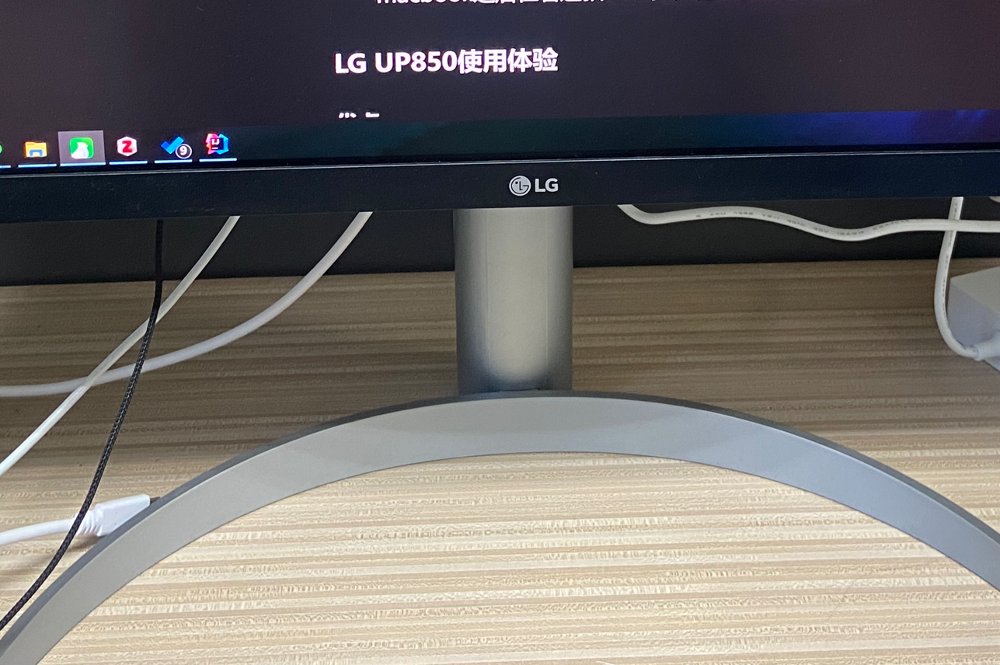
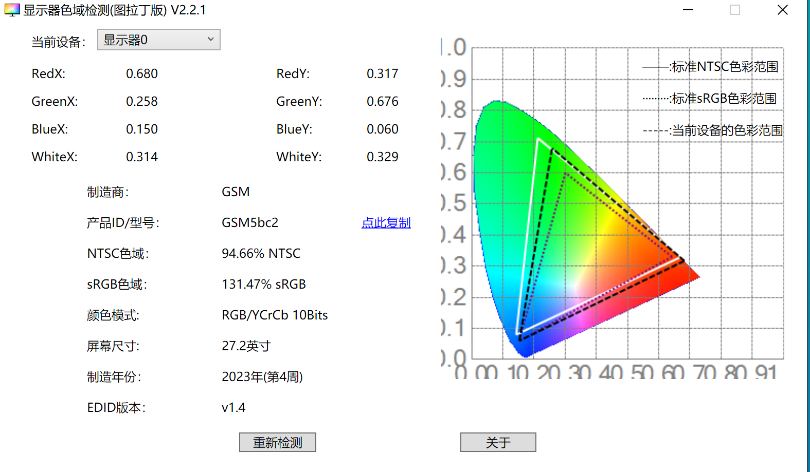

# 一、前因
因为实验室配了主机，就把原来的拯救者R9000P 2021给卖了，还好买的早，新品发布后，闲鱼二手价比我的出手价又低了1000，差点亏麻。
由于这学期还是有些课的，所以准备买个轻薄本，最终选择了macbook air m1，闲鱼4900入手，这个过程以后值得单独写一篇文章细说。买了macbook之后，依赖我原来的AOC 4K显示器的色彩就有些不够看了，而来也想试试type-c直接将macbook外接显示器使用（~~虽然买完显示器之后基本没有外接过，主要是台式机跑AI要方便一些~~）。
# 二、之前用过的4K显示器
## 1. KOIOS 忘了什么型号了 27寸
入门级的4K显示器主打性价比，千元入门，色彩有点差，分辨率没问题，但是看久了有点累。
## 2. AOC U2790PQU 27寸
也是一款入门级的4K显示器，原价1800买的（一年后1600了），看久了有点累，而且用上macbook之后在看这款AOC多少有些由奢入俭难了。
# 三、使用体验
## 1. 外观

## 2. 优点

1. 色彩不错：各种参数都很好

2. 接口还算丰富：我主要是馋那个type-c接口，因为我需要连接我的macbook。HDMI2.0好像接口最多只能输出8bit色深，DP接口可输出10bit色深，需要在NVIDIA控制面板设置一下。
3. 有内置音响：我一般不外放，但是我的主机声卡有问题，有杂音，所以显示器有个音响也挺好的，就是有线耳机容易干扰我打字，这是比较烦人的。
## 3. 缺点

1. 大砖头电源：毕竟显示效果好，功率比较大也是在所难免，不能做成内置电源，只能带个大砖头，不过还好，我桌子还是比较宽敞的，不算大缺点。
2. 多设别切换声音不统一：我通常DP连接主机，type-c连接macbook，后者偶尔连一下。不论是有限还是蓝牙，切换电脑室都需要切换设备，为了省点事，加上主机的音响有杂音，我直接用显示器的音响，但是切换设备后两台机器的音量是不同步的，每次都得重新调整，非常烦，显示器连接主机时把声音调好之后，到macbook声音非常大，不知道有什么办法可以解决。
> 小插曲，第一次到手左上角出现了坏点，我人麻了，又去换了货，耽误了两三天，这是比较不爽的点，其他的话都还好吧。

# 四、总结
目前正在使用这款LG 27UP850N -W，虽然肯定比不上那些四五千或者上万的显示器，但是对于不打游戏的我来说，4K加很好的色彩表现是完全够用了。
选择它的主要原因还是对于mac的适配，看了很多款，还是选择了它，主要是不相信小厂，像什么酷优派什么的感觉不大靠谱，大厂的话主要就是DELL、LG、明基之类的了，纠结与明基的网红款之后，参考了B站UP主的视频（忘记是谁的了），最终选择了这款。
这款显示器其实是2021年发布的显示器，当年首发好像得要4000多，现在只需要2500，因此性价比非常高。今年（2023）有它的升级款，UQ850，但是参数提升不大，而价格却来到了4399，性价比非常低，我都4399了，还不如买LG专门适配mac的ultrafine 4K了呢，ultrafine 4K原价大概5399，二手差不多4000多。我个人预算有限，没狠下心买ultrafine 4K，于是选择了这款性价比非常不错的UP850。
感觉下学期又要将我的macbook给卖了，目前确实没有大用，也就每天上课摸鱼，晚上回寝室继续摸鱼（~~被自己给无语到了~~）。
