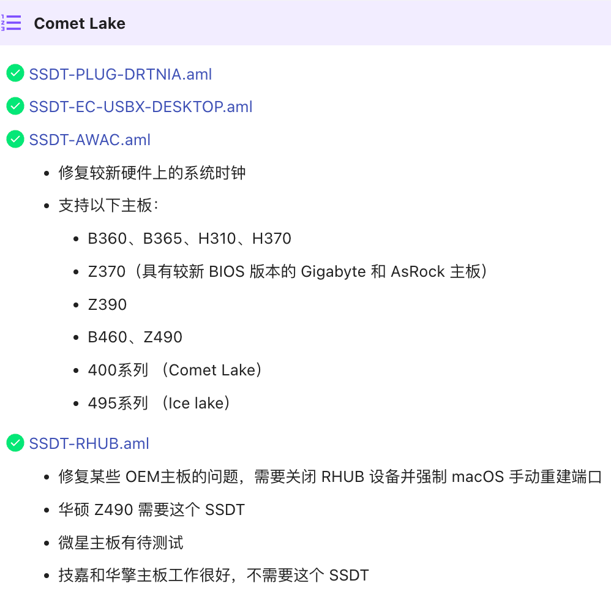
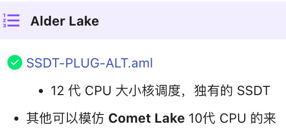
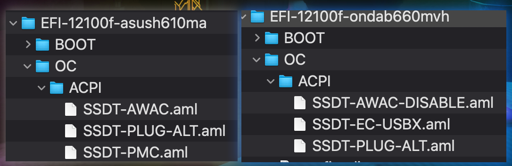
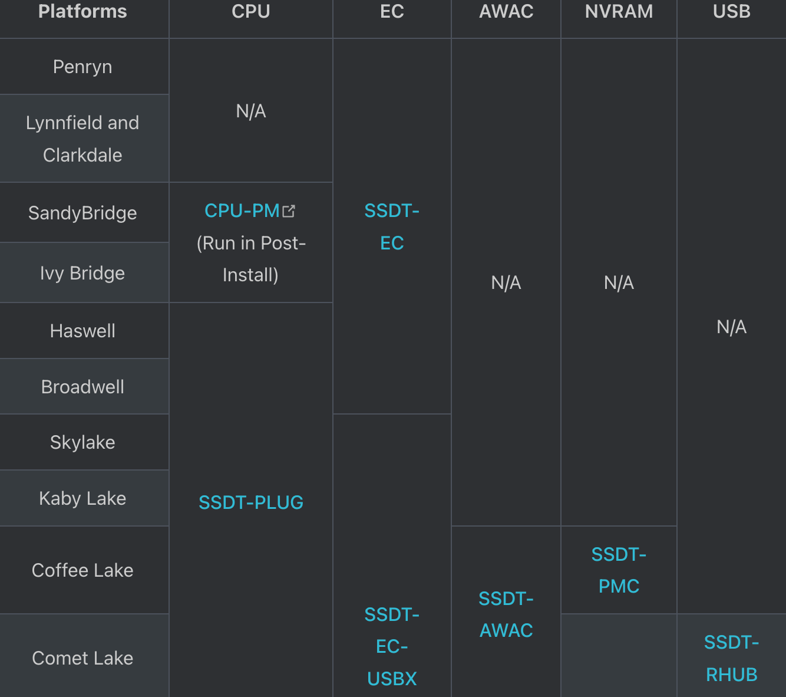
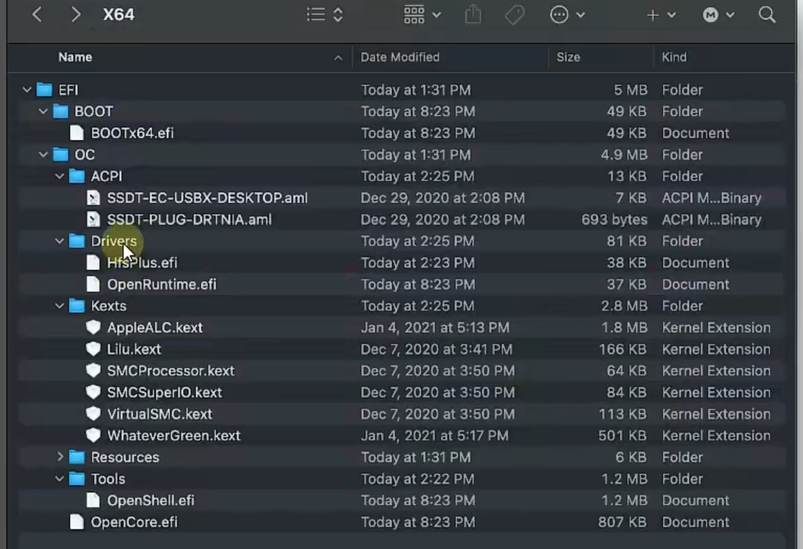

# ACPI文件

[https://apple.sqlsec.com/3-%E5%87%86%E5%A4%87%E5%B7%A5%E4%BD%9C/3-3/](https://apple.sqlsec.com/3-准备工作/3-3/)

1. Advanced Configuration and Power Interface
2. 10代以后的intelCPU都是仿造10代的：
3. 12代起，如果有大小核，还需要额外的大小核调度ACPI：
4. 网上找的12100F的ACPI：

❓发现两个ACPI的结构不相同

都有PLUG-ALT，但是其他两个不同

1. 按照官网应该有四个来着：https://dortania.github.io/Getting-Started-With-ACPI/ssdt-platform.html#desktop
2. 10代以上不使用SSDT-PLUG-DRTNIA.aml，而是去docs文件夹里面用SSDT-PLUG-ALT.aml替代，进行CPU仿冒
3. 13代示例：
4. 