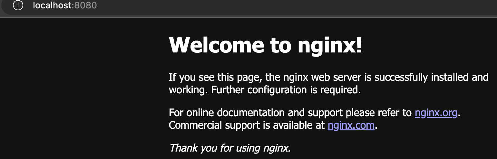

# 安装Homebrew

brew list

# 安装MySQL

直接去官网下载，注意选择arm版本

sudo vim ~/.bash_profile

添加：export PATH=$PATH:/usr/local/mysql/bin

mysql --version

# 安装Nginx

https://segmentfault.com/a/1190000040086358

brew install nginx 

brew services start nginx

启动：nginx

关闭：nginx -s sotp

重启：nginx -s reload

查看版本：nginx -v

检验启动是否成功：