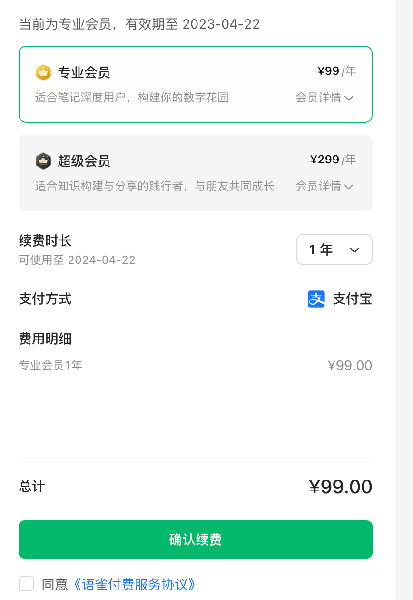

上大学开始，使用纸的时间就越来越少了，包括纸币💸和纸笔🗒🖊。记笔记的方式也从用笔写在笔记本上💻，转向了使用电子产品键盘输入⌨️。先谈谈我用过的笔记软件吧，我将笔记软件分为两类，本地笔记软件和云笔记软件

# 一、本地笔记软件

## Typora

我目前还在使用的本地笔记软件，甚至付费成为了终身用户😢，毕竟也不贵，89永久，主要是实在太好用了，typora免费的时候我就开始用了，收费后放弃了一段时间，也尝试过免费的typedown和下面要说的vscode，但是始终无法完美替代，破解的话每次打开都弹出提示（可能是我没破解好），于是只好支付89人民币买断。目前还不能处理与语雀的矛盾，暂时用作markdown文件编辑器，有点小后悔🤡。

## Visual Studio Code + 插件

通过VS Code加上markdown all in one等插件（直接在插件商店里搜索markdown，找几个下载量高的安装即可），可以得到比较不错的markdown使用体验，但是像编写前端代码一样，需要额外一个窗口进行预览，实时预览方面稍微差点🤧，可以通过创建git仓库进行手动云同步。关于git简单操作可以参考我的git入门教程：

# 二、云笔记软件

## 重度使用过的

1. 有道云笔记：非常棒，几乎是99%的完美👍，免费功能基本能满足需求，免费空间很大，我好像有5G，记笔记基本用不完，多设备同步也很好，可以离线查看笔记，唯一不足就是颜值实在不行，而且免费用户对外观的修改权限实在有限，于是最终放弃，但是我还是强烈推荐免费用户使用有道云笔记👍。
2. 思源笔记：界面很漂亮，颜值超高😍，免费用户的功能除了云同步基本都有，跨设备也不错，但是因为云同步要花钱，最终还是放弃了。作为一个本地软件还是很不错的，但是本地文件的保存形式好像不是markdown，需要额外导出，不开通云同步功能的话我还不如选择typora呢😂。

## 轻度使用过的

1. 印象笔记：忘记是不是因为付费才放弃使用了，当时觉得还不如有道云呢😅，于是放弃了。
2. Notion：功能非常强大，很多人都在用，很多人都在推荐，很多人都在吹🤔，除了网络问题导致的不稳定、不能本地存储外堪称无敌，但是我个人觉得笔记软件不需要太多复杂的功能😳，因此没有使用。当然，部分notion用户基本上把notion当做效率软件，而不只是笔记软件了，因而对此爱不释手，不过我还是懒得去折腾了🤧。
3. 飞书、腾讯文档：下载安装后，几分钟就卸载了，感觉以办公为主，不算是传统的笔记软件。
4. Obsidian：需要安装很多的插件，功能也很强大，但是我懒得折腾，还不如VS Code呢。
5. FlowUs：功能太复杂了，我愿称之为国产小notion。

以上都是我轻度使用过的，所以认知上有很多错误，大家随便看看就好。

# 我最终为什么选择语雀

## 优点

1. 能够云端同步
2. 蚂蚁金服开发，大厂背书，稳定可靠
3. 免费用户功能比较完整，中低强度使用者不充钱完全够用
4. 多设备同步，包括windows、macos、ios、android（linux就无所谓了，我不care）
5. 界面简洁美观，个人还是十分满意的
6. 会员不算贵，一年99元，性价比很不错，我都打算开一个会员了😙

## 缺点

1. 有了语雀，还需要typora吗？😢正如上面提到的，我现在的typora有点像是markdown文件编辑器了，现在想记录优先考虑用语雀记录云端存储。
2. 每个月的免费额度是50篇，小记（一种随手记的方式）数量也算在内，时不时地送我7天体验会员，但是也担心会不会有时候免费额度不够用，主要是一种焦虑😥
3. 以前也传出过很多关于语雀不好的消息，但是我目前使用一个月还没有遇到什么问题😳

# 总结

软件使用是个很主观的东西，加上我很多软件的使用时间都不算长，因此本文只能说是使用体验分享，不算是合格的评测，B站有很多评测视频，就不再这里班门弄斧了。目前语雀使用一切ok，本文也是语雀里写的，希望各位也能够找到合适自己的笔记软件！