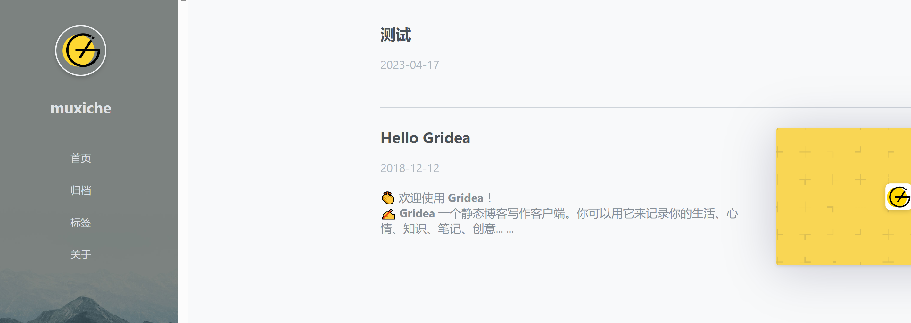
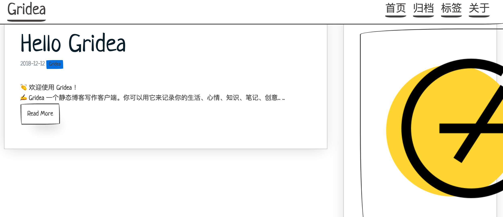
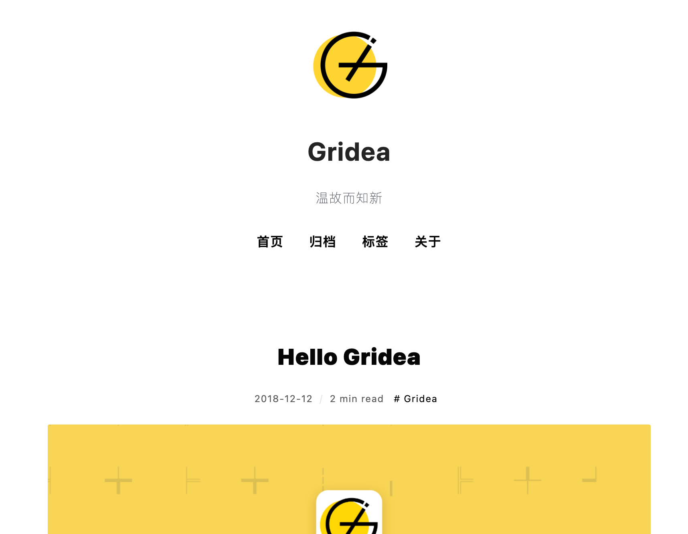
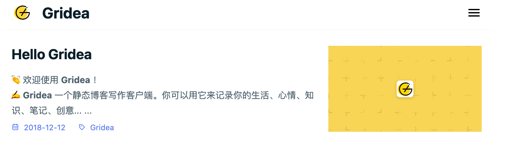
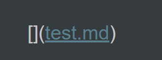
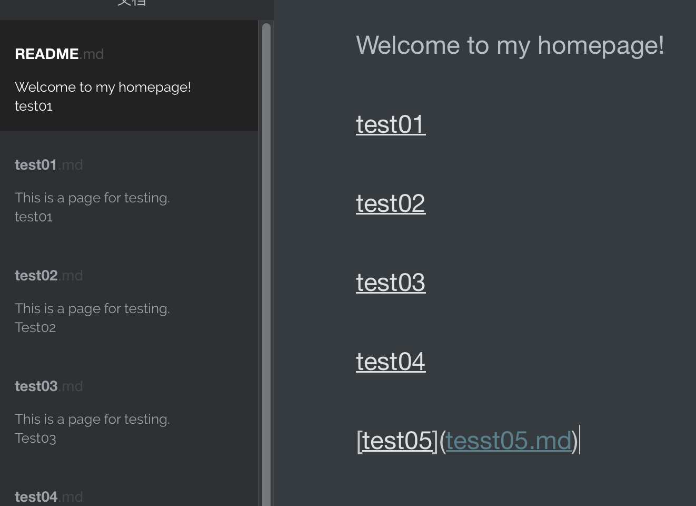
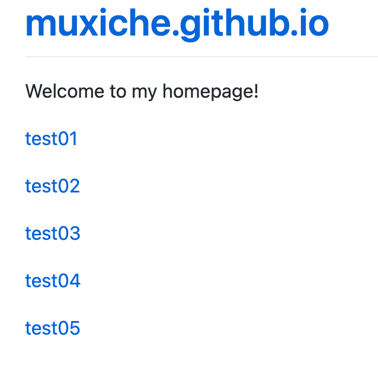
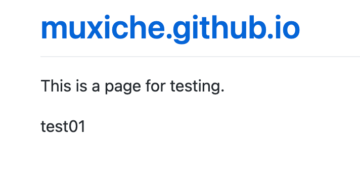
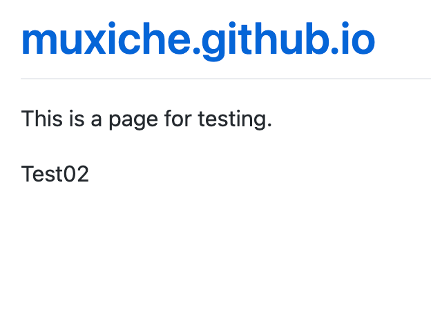
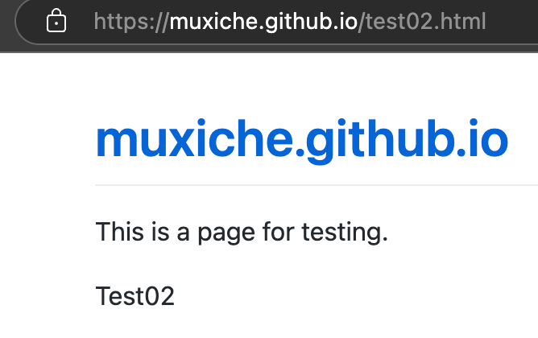

# 为什么需要搭建个人博客

打造一个独属于自己的空间

搭建个人博客的方法有很多，我自己也是尝试了很多种方式，现在将自己的经验分享给大家

# 自己买服务器搭建

可以用一台PC主机（如NAS）进行本地部署，也可以使用云服务器，只是部署个人网站的话，笔者推荐使用云服务器，自己弄一台主机未免有些浪费了

国内外很多知名的互联网公司都有云服务，本文主要推荐国内的几个大厂，如阿里云、华为云、腾讯云等，这些平台通常会推出新手福利活动，一年只需要100多元，平时价格可能得上千。只是搭建个人博客的话，1核2G内存或者2核4G内存的就够了。

PS：笔者在华为云申请了一个2核4G内存云服务器，尝试过部署一个java电商项目，中间件一多直接卡死，应该是配置不够了，无奈只好使用虚拟机本地部署。

注意：新手区一般有一次福利，可以很便宜地购买一个小但是够用的云服务器，所以可以使用完一个平台的新手福利后，换一个平台继续薅羊毛，把数据备份好，上一个平台到期后迁移过去即可

可以使用宝塔面板对服务器进行管理，也可以自己远程连接linux系统手动搭建，这里推荐xshell或者tabby所谓ssh远程连接工具，都是免费的，xshell免费版需要填写邮箱，下载链接会发送到邮箱，直接下载即可，远程传输文件还需要额外选择xftp软件选项，也是免费。

## 完全DIY

需要掌握一定的前后端开发技术才能做出一个比较不错的网页。

如果掌握了这些技术的话估计也不需要看这篇文章了😂。

## 半DIY

自己买好服务器，使用第三方平台意见部署网站，平台会提供很多服务，基本是傻瓜式操作

1. wordpress：可以使用宝塔面板一键部署，非常方便，也可以自己远程连接服务器，不论是直接安装wordpress还是使用docker安装wordpress都可以。
2. hexo：与wordpress类似，笔者没有用过，但是也不难
3. Gridea：Gridea的缺点是不能多设备同步，小心不同设备之间的覆盖，一定要慎用，如果只有一台主机操作网页的话，还是很推荐Gridea的，但是笔者一台macbook，一台windows主机，时常需要多设备操作，因此放弃了Gridea。

# 使用第三方平台的服务器

1. github：githubpages
2. gitee：giteepages

这两种方式不需要自己买服务器，github或者gitee会自己提供云存储服务，免费且永久（太爽啦٩(๑>◡<๑)۶）笔者目前使用githubpages，可以使用jekly进行美化，原理和hexo差不多，笔者不想折腾了，追求极简，于是直接用markdown代替网页。

使用githubpages + Gridea的经验

一定要关闭fastgithub再进行远程测试，否则会断连

gridea不能多设备同步，很烦

主题一览：

1. simple：

1. paper：不知道为什么，好像适配不了小屏幕

1. notes:

1. fly

1. asd

## 

# 我的选择

极简永久免费方案：githubpages + git + typora

typora以前免费，现在需要付费，89人民币永久，我买了永久，但是windows端和macos端都有“学习版”，可以自行查找如何“学习”，也可以使用别的markdown软件，typora不是必须项。

为什么不选择giteepages，因为需要实名认证，而且可能需要审核，用着不顺畅，github不需要实名，除了有时候网络不大好，git上传会卡住不方便外，可以想写什么写什么

注意：访问页面不会出现卡顿情况，因此不用担心别人访问博客卡住

欢迎访问我的博客：https://muxiche.github.io/

排版

通过实现页面跳转

我通常用作githubpages的页面，这样可以不用做页面的链接

README.md作为主页：

主页效果：

点击test01.md：

点击muxiche.github.io可以回到主页

点击test02.md：

页面切换很顺利

可以看到github将我们的markdown文件自动渲染成了html文件：

## 一键设计logo

https://uugai.com/