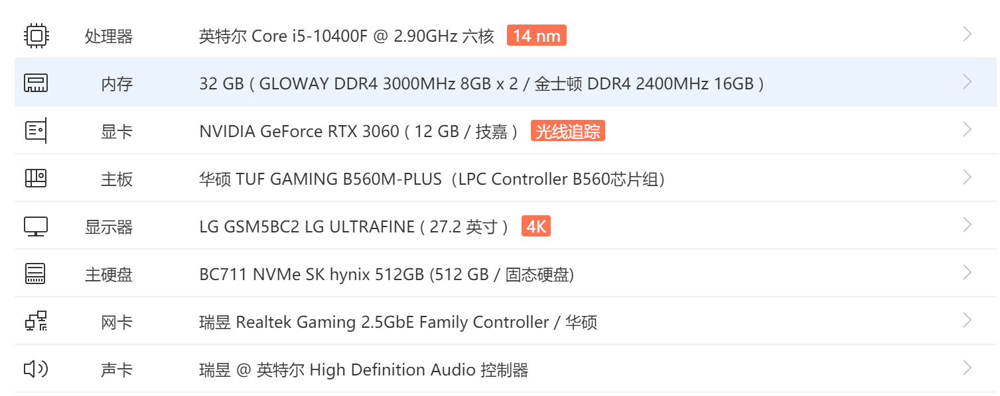

本教程对于windows11和其他NVIDIA的显卡同样适用

# 笔者个人硬件配置



只要是NVIDIA的显卡都可以使用cuda进行加速计算，比较古老的N卡情况可能会比较复杂，我就不清楚了。

# Python环境配置

推荐使用miniconda或者anaconda管理python虚拟环境和包

# PyTorch环境配置

## 安装PyTorch GPU版本

一定要注意安装的是CPU版本还是GPU版本，如果要是用cuda加速，一定要安装GPU版本

官网有下载链接，可以直接在命令行的某个conda环境下载，但是通常速度很慢，甚至卡住。因此我推荐使用离线安装的方式，先下载whl后缀文件，然后用pip install安装，镜像网站的下载速度很快，安装也很快、很稳定。


## （可选）安装torchvision

如果是做计算机视觉方向，需要下载这个包

## （可选）安装torchaudio

如果是做音频处理方向，需要下载这个包

本人不是很清楚，但是使用AI唱歌是，用到了这个包

# 检验是否安装成功

```python
import torch
print(torch.__version__)
print(torch.cuda.is_available())
```