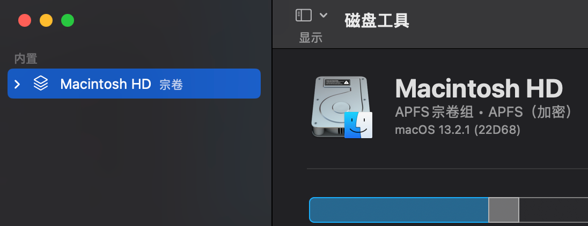

# 零、前言

# 一、什么是黑苹果

黑苹果的英文名称是Hackintosh，是Hack和Macintosh的结合，

苹果电脑中，硬盘的默认名称是Macintosh。可以通过打开磁盘工具来查看：

不同于别的PC，苹果电脑不能够DIY，硬件全部由苹果官方一条龙组装完成，我们日常使用的电脑是无法适配MacOS的。而各路大神希望能在普通电脑上使用MacOS系统，于是通过一些软件程序将普通PC的硬件模拟成苹果的硬件，欺骗MacOS。因此，“黑苹果”的“黑是“黑客”的“黑”，是指在PC设备上安装MacOS，而不是指把苹果系统MacOS给黑了。

# 二、黑苹果硬件配置简介

前面提到了，黑苹果也是使用的MacOS，因为MacOS是封闭的，各路大神还没有厉害到能够直接破解苹果系统的地步。

黑苹果通常选用intel的cpu和amd的显卡

# 三、为什么选择黑苹果

## 更高的性价比

## MacOS的局限性

# 四、如何安装黑苹果

## 硬件要求

最好是intel的cpu加上amd的显卡，其他的搭配其实也可以，但是比较麻烦，目前主流配置是前者

## 软件要求

参考opencore官方指导文档

## 引导文件

## 教程推荐

## 资源推荐

### github

github是一个开源代码库以及版本控制系统，上面大部分项目都是开源的，可以直接搜索主板或者CPU型号找到别人配置好的EFI文件，因为github主要是软件方面的分享，所以你搜索硬件配置，出来的主要就是黑苹果配置，基本不需要担心出来太多太杂的东西

### 大佬的博客

1. 黑果小兵
1. 国光酱

### b站

1. b站的EFI文件其实也基本上是从github上找来的，主要是有视频教程，相较于各种博客上面的文字和图片，视频演示对于小白更加友好

### 付费定制

1. 淘宝店
1. 闲鱼也有，但是还是推荐比较老的淘宝店，50-100可以搞定