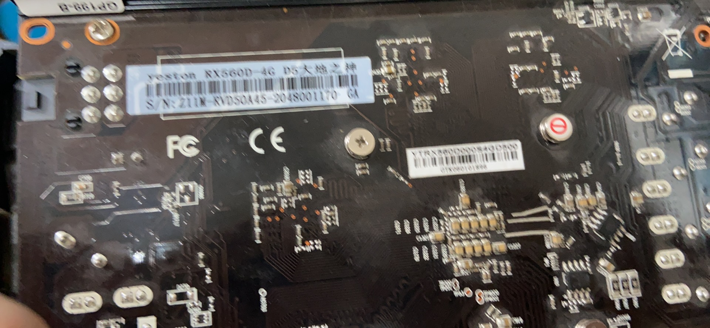
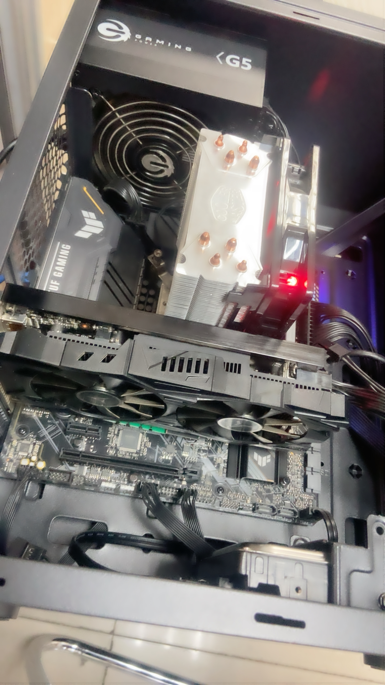
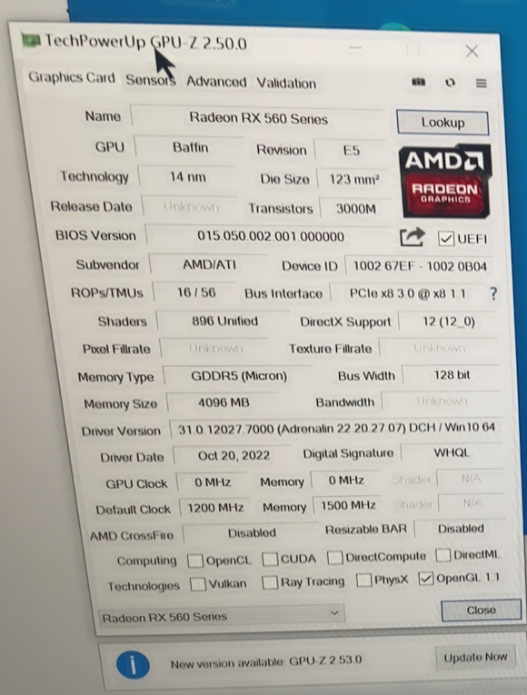
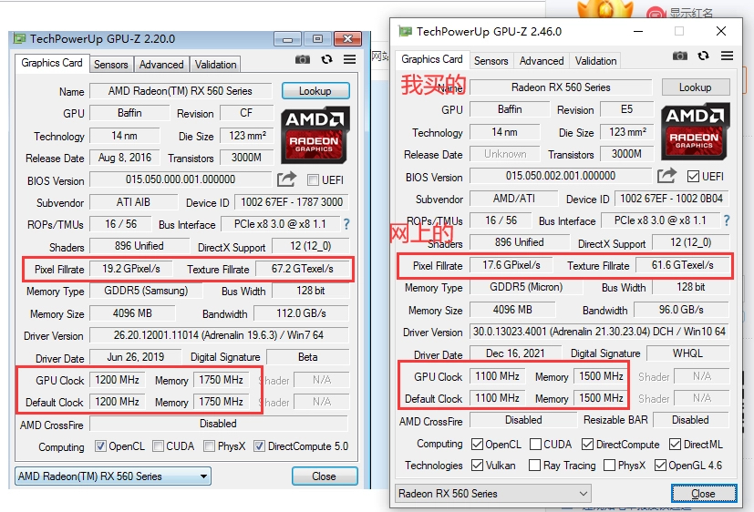
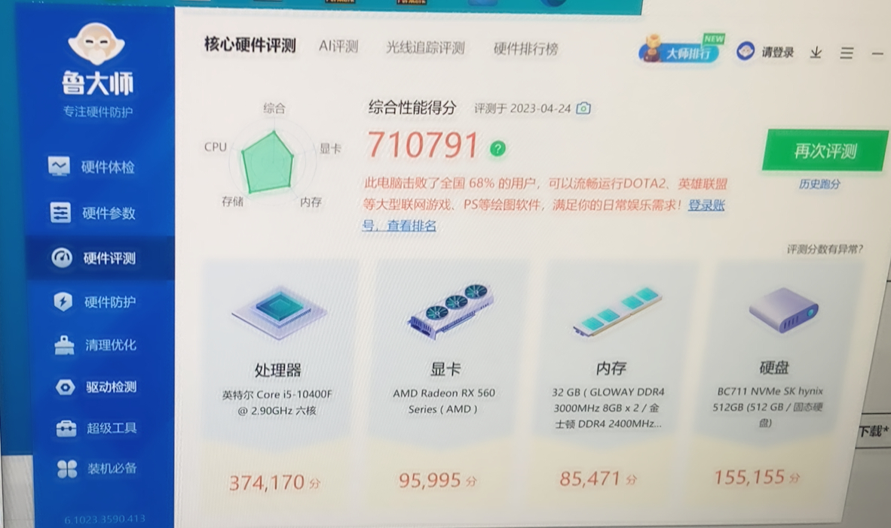
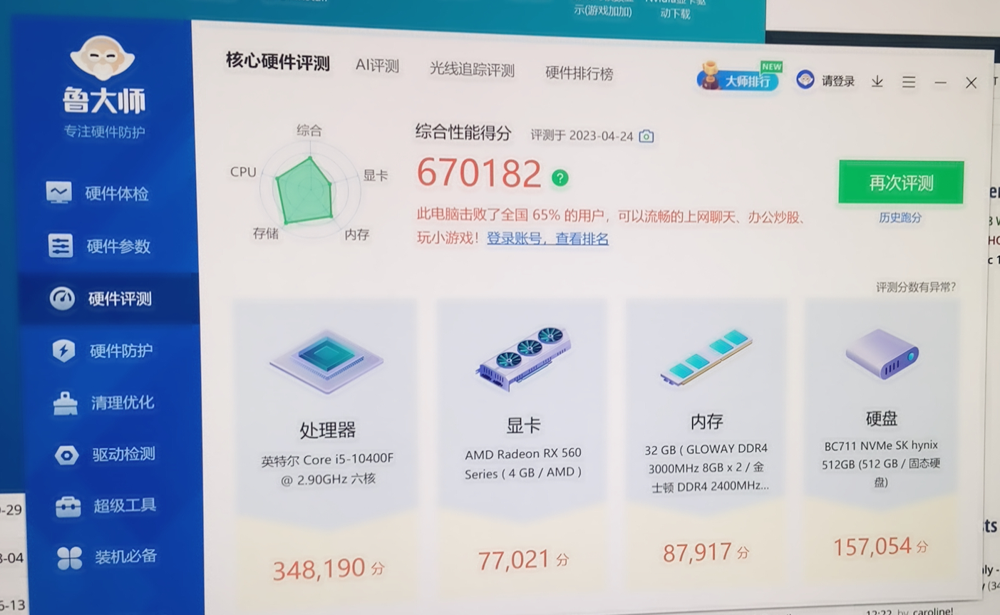
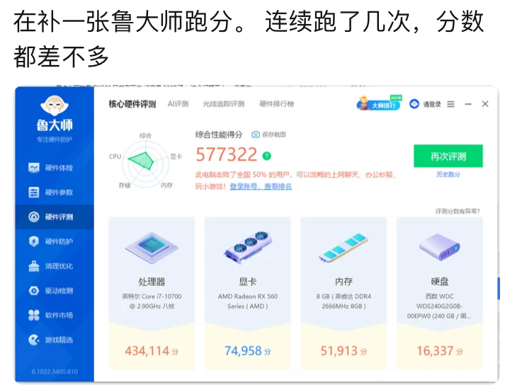
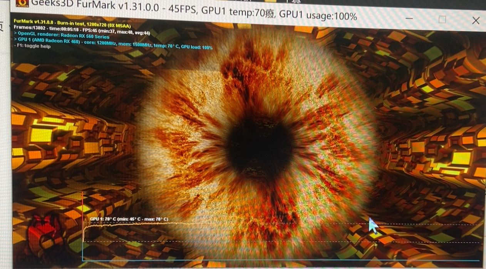
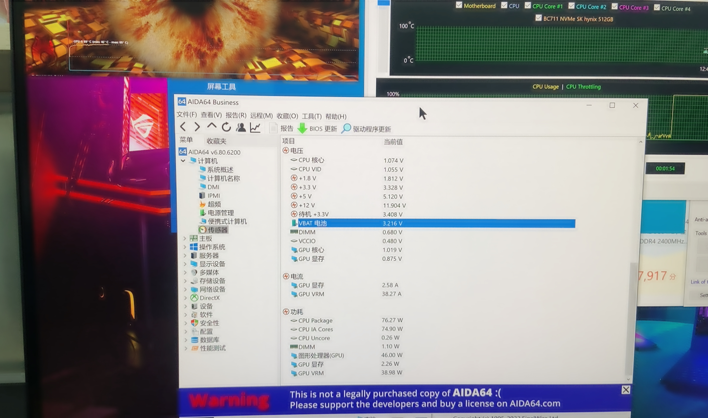

# 一、前言
## 1. 需求
为黑苹果做准备（~~做个屁的准备，其实就是忍不住想捡垃圾了~~~~，瘾犯了（bushi）~~），由于自己视频剪辑需求不高，准备先低成本捡一张A卡，主要考虑500系，先练练手。买二手显卡首先要考虑矿卡的风险，580 8G这种经历了三次矿潮，我是绝对不敢买的，哪怕刚开始用着没问题，也极有可能突然暴毙。470、570、580好像都有4G的版本，我不是很清楚，就先不考虑这三张了，最终从RX460和RX560里面选，还是不想要太老的卡，最终锁定RX560 4G。
## 2. 经过
闲鱼蹲了几天，买了一张560D，卖家说是完全自用的，并且有箱说，4G显存不代表不能挖矿，但是只能挖早期的杂币（听网上说的），4G显存的卡最多挖过一次，所以风险不算太高。我看他自带箱说，芝麻信用比较高，自用可信度还是比较高的，但是原价280多，妥妥的传家宝，于是我小砍了一刀，最终还是花了高价，感觉亏麻了，起码亏50，这卡目前200以内算是合理价格。后来在B站看到了一个二手显卡捡垃圾的分析视频，感觉还不错，链接：[https://www.bilibili.com/video/BV17c411J7Xf](https://www.bilibili.com/video/BV17c411J7Xf)
# 二、黑苹果免驱A卡
凭印象整理，可能有很多错误，黑苹果目前免驱的显卡还是蛮多的
更早的就不说了。
## 1. 400系
RX460、RX470、RX480
## 2. 500系
RX550、RX560、RX560D、RX570、RX580、RX590
500系的水实在是太深了，下面细说

1. RX550在黑苹果能不能免驱得看核心，核心是Polaris（北极星就免驱），如果不是，需要刷BIOS
2. RX560D是RX560的阉割版本，流处理器个数由RX560的1024砍成了896
3. RX570和RX580都有4G版本，要比8G版本稳定得多
4. RX580是水最深的显卡，没有之一，580分为满血版和残血版，残血版也是580 8G，但是着色器只有2048个（商家一般会标注2048SP），500系水为什么深，主要原因就是AMD显卡的400系和500系核心差不多，只是规格不同，所以不同的显卡可以通过BIOS实现一样的性能，并且一些硬件软件也会识别成BIOS的类型，比如，讯景RX 560 4G可以刷蓝宝石RX 560 4G的BIOS，系统就会识别成蓝宝石RX 560 4G
> 着色器也叫流处理器，也就是Stream Processer，所以简称SP

5. RX590也有很多版本，比如RX590GME就是残血版的590，其实是580换皮，免驱需要刷580满血的BIOS
## 3. 5000系
RX5500XT、RX5600XT、RX5700XT
全是矿，比580好不到哪里去，但是性价比挺高的，我反正不敢买
## 4. 6000系
RX6600、RX6600XT、RX6700XT、RX6800、RX6800XT
目前性价比最高的还得是RX6600，因为发行比较晚，可以挑2022年下半年之后出厂的显卡，矿的概率较小，就算挖过矿，时间也不长，买二手的时候如果有箱说和购买记录就基本稳了，目前最低不到900，新一些的还是得1000，1000以上纯纯传家宝。
# 三、验货
## 1. 官网图片

## 2. SN码

## 3. 装机实拍

## 4. GPU-Z参数
我的GPU-Z参数如下：

别人RX560D帖子的参数如下：

## 5. 新版鲁大师跑分

别人帖子的跑分：

这样一看200多元580满血18万分真是性价比之王，可惜我不敢赌，卡诺基多接口版本又太贵了，而且580功耗高很多，我用不上，这张560D满载功耗才45W

## 6. 双烤
双烤甜甜圈：

功耗：

# 四、本次捡垃圾总结
## 1. 亏不亏
亏麻了！250的东西，起码亏50，唉，这几天心里一直难受。早知道应该认准RX460来着，或者捡一张自用的560D即可，4G显存也没啥好顾虑的，不过买都买了，只能认了。
## 2. 显卡改色
我以后准备组个纯白主机，因此，想把这张黑色显卡改个色，原来的颜色实在是太丑了，也正好练练动手能力。
显卡改色目前主要有两种方案，一是喷漆，虽然我觉得技术难度比较高，但是看了一些视频发现其实不算难，毕竟我要求也不高；另一种是贴膜，在贴吧看到了教程（[https://tieba.baidu.com/p/7873313455](https://tieba.baidu.com/p/7873313455)），目前已经下单了汽车的膜。反正这张显卡200多，早就过保了，随便折腾吧，只要性能不出问题就好。改好色先挂到闲鱼吧，反正也是闲置，主要是心血来潮，想去淘个宝，结果当了怨种，被传家宝蒙蔽了双眼。
## 3. 下一张显卡
以后准备换6000系的显卡，但是那是至少一年以后的事情了。目前综合各方面因素，性价比比较高的是RX6600，5000系就不考虑了，毕竟我是打算长期使用。如果手头宽裕了可以买盈通的花嫁，颜值真的挺高的，可惜花嫁没有低端一点的6600和6600XT，考虑性价比还是买6600吧。

